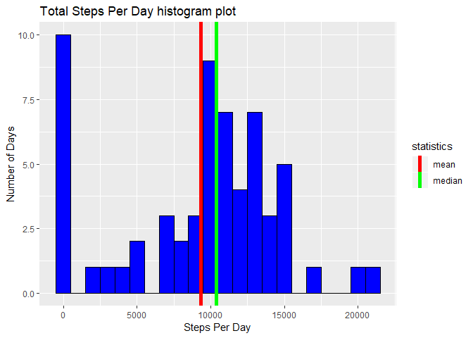
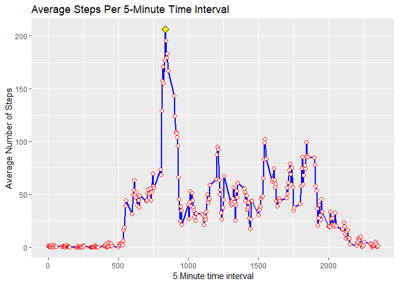
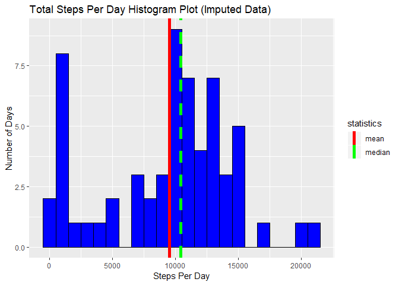
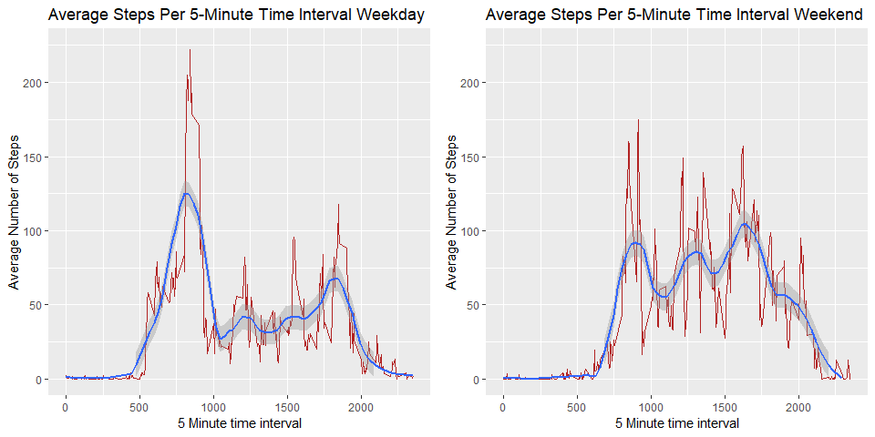

It is now possible to collect a large amount of data about personal movement using activity monitoring devices such as a [Fitbit](http://www.fitbit.com/), [Nike Fuelband](http://www.nike.com/us/en_us/c/nikeplus-fuelband), or [Jawbone Up](https://jawbone.com/up). These type of devices are part of the “quantified self” movement – a group of enthusiasts who take measurements about themselves regularly to improve their health, to find patterns in their behavior, or because they are tech geeks. But these data remain under-utilized both because the raw data are hard to obtain and there is a lack of statistical methods and software for processing and interpreting the data.

This assignment makes use of data from a personal activity monitoring device. This device collects data at 5 minute intervals through out the day. The data consists of two months of data from an anonymous individual collected during the months of October and November, 2012 and include the number of steps taken in 5 minute intervals each day.

The data for this assignment can be downloaded from the course web site:

Dataset:[Activity monitoring data](https://d396qusza40orc.cloudfront.net/repdata%2Fdata%2Factivity.zip) [52K]

The variables included in this dataset are:

steps: Number of steps taking in a 5-minute interval (missing values are coded as $\color{red}{\text{NA}}$)

date: The date on which the measurement was taken in YYYY-MM-DD format

interval: Identifier for the 5-minute interval in which measurement was taken

The dataset is stored in a comma-separated-value (CSV) file and there are a total of 17,568 observations in this dataset.


## Loading and preprocessing the data

The `dplyr`, `plotly`, and `ggplot2` are loaded as an initial step. Then the data is loaded and unzipped from the "activity.zip" file. the data is assigned to a variable named `data` and a variable named `byDay` which is grouped by date using the `group_by` function.


```r
library(dplyr)
library(plotly)
library(ggplot2)
```


```r
data <- read.csv(unz("activity.zip", "activity.csv"), header = TRUE,
                 sep = ",") 
byDay <- data %>% group_by(date) 
```


## What is mean total number of steps taken per day?

The mean total number of steps taken per day is calculated by summarizing the summed data in the `byDate` variable which is grouped by `date`. The `mean` and `median` of the total number of steps is also calculated.


```r
sumByDay <- byDay %>% summarise(sum = sum(steps, na.rm = TRUE))
dayMean <- mean(sumByDay$sum)
dayMedian <- median(sumByDay$sum)
```

A histogram of the total number of steps taken per day can be found below. The calculated 
mean steps per day is 9354 and the calculated median steps per day is 10395.


```r
p1 <- ggplot(sumByDay, aes (x=sum)) +
        geom_histogram(binwidth = 1000, color = "black", fill = "blue") +
        geom_vline(aes(xintercept=mean(sum),color="mean"),
            linetype="solid", size=2)+
        geom_vline(aes(xintercept=median(sum), color="median"),
            linetype="solid", size=2)+
        scale_color_manual(name = "statistics", 
                            values = c(median = "green", mean = "red")) +
        labs(title="Total Steps Per Day histogram plot",x="Steps Per Day", 
             y = "Number of Days")

p1
```

<!-- -->

## What is the average daily activity pattern?

The average daily activity for each 5-minute interval can be found by grouping 
the original data by `interval` and summarizing by the `mean` for the total number of steps for
each interval as shown in the code below. A line plot of the average 
steps per interval is also shown below. the maximum value is represented by a yellow diamond.


```r
avg5min <- data %>% group_by(interval) %>% summarise(avg = mean(steps, na.rm = TRUE))

maxAverageInterval <- max(avg5min$avg)
locationMax <- which.max(avg5min$avg)
```


```r
p2 <- ggplot(data = avg5min, aes(x = interval, y = avg, group = 1)) + 
        geom_line( size = 1, colour = 'blue') +
        geom_point(size = 2, colour = 'red', shape=21, fill="white") +
        geom_point(aes(x=avg5min$interval[locationMax], 
                       y=avg5min$avg[locationMax]), shape=23, fill="yellow", 
                        color="black", size=3  ) +
        labs(title="Average Steps Per 5-Minute Time Interval", x="5 Minute time interval", 
             y = "Average Number of Steps")
p2
```

<!-- -->

The maximum mean value of steps was determined to occure in the 
835 5-minute interval with a value of 
206.

## Imputing missing values

The code below uses na.aggregate from the "zoo" package to replace the missing 
steps data. In this case, The `na.aggregate` function works by replacing each `NA` in the input object by the `median`, or any other defined function, of it's group, which in this case is the `interval`. The sum of the total number of steps is calculated and the mean and median values of the sums are determined.


```r
library(zoo)
```


```r
imputedData <- data %>% mutate(steps = na.aggregate(steps, by = interval,FUN = median))

sumByDay2 <- imputedData %>% group_by(date) %>% 
        summarise(sum = sum(steps))
dayMean2 <- mean(sumByDay2$sum)
dayMedian2 <- median(sumByDay2$sum)
```

A histgram of the total number of steps per day using the new imputed data set is made and the mean and median values are determined to be 9503 and 10395 respectively.
 

```r
p3 <- ggplot(sumByDay2, aes (x=sum)) +
        geom_histogram(binwidth = 1000, color = "black", fill = "blue") +
        geom_vline(aes(xintercept=mean(sum),color="mean"),
            linetype="solid", size=2)+
        geom_vline(aes(xintercept=median(sum), color="median"),
            linetype="dashed", size=2)+
        scale_color_manual(name = "statistics", 
                            values = c(median = "green", mean = "red")) +
        labs(title="Total Steps Per Day Histogram Plot (Imputed Data)",x="Steps Per Day", 
             y = "Number of Days")
p3
```

<!-- -->

## Are there differences in activity patterns between weekdays and weekends?

The `lubridate` and `stringr` packages are loaded

```r
library(lubridate)
library(stringr)
```
A variable `date` is converted into a date class using the `as.Date` function. Then a variable, `day` is added which contains the decriptive name of the day of the week. The names in day are converted into logicals of `TRUE` for weekends and `False` for weekdays. The logicals are then renamed `weekday` or `weekend` and turned into factors based on there logical value. The average number of steps taken per 5 minute interval is then calculated for both weekend and weekdays.  


```r
dataDate <- data %>% mutate(date = as.Date(date, format = "%Y-%m-%d")) 
daysOfWeek <- dataDate %>% mutate(day = weekdays(date, abbreviate = FALSE)) %>%
        mutate(type = str_detect(day, "Saturday|Sunday")) %>%
        mutate(type = factor(type, levels = c(FALSE,TRUE), labels = c('weekday','weekend')))

weekdays <- daysOfWeek %>% filter(type == "weekday") %>% group_by(interval) %>%
        summarise(avg = mean(steps, na.rm = TRUE))
      

weekend <- daysOfWeek %>% filter(type == "weekend") %>% group_by(interval) %>%
        summarise(avg = mean(steps, na.rm = TRUE))
```

A plot of the average number of steps taken per 5-minute interval for the weekend
and weekdays can be seen the panel plot below. In order to help determine if there are differences in the patterns, a line was fit to the data using the `geom_smooth` function with a `span = .25` to each plot. Comparing the fitted line suggests that on the weekend, people are walking less earlier in the day and more during the middle and latter part of the day.  


```r
library("gridExtra")
```


```r
p4a <- qplot(interval, avg, data = weekdays,alpha = I(1/1000)) + geom_line( size = .5, colour = 'firebrick') +
        labs(title="Average Steps Per 5-Minute Time Interval Weekday", x="5 Minute time interval", 
             y = "Average Number of Steps") + geom_smooth(span = 0.25) + ylim(0,225)

p4b <- qplot(interval, avg, data = weekend, alpha = I(1/1000)) + geom_line( size = .5, colour = 'firebrick') + 
        labs(title="Average Steps Per 5-Minute Time Interval Weekend", x="5 Minute time interval", 
             y = "Average Number of Steps") + geom_smooth(span = 0.25) + ylim(0,225)


p4c <- grid.arrange(p4a,p4b,ncol=2)
```

<!-- -->


